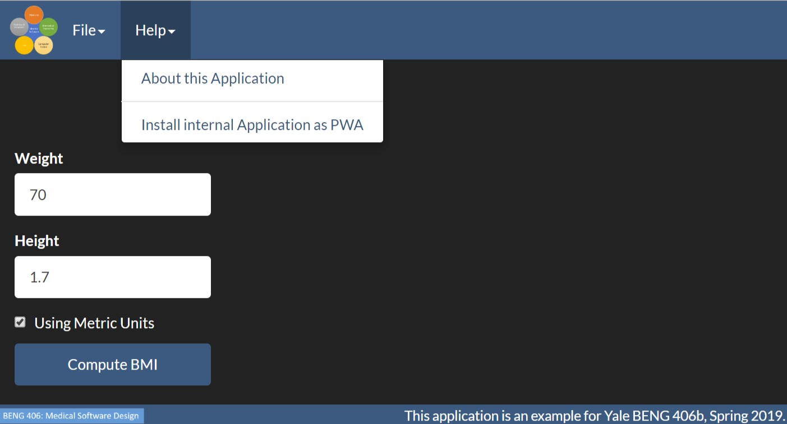

## Yale BENG 406b Complete Example

This is a complex example made available to the students of Yale BENG 406b
(Spring 2019). It makes use of some code from
[BioImage Suite Web ](https://github.com/bioimagesuiteweb/bisweb/)

## Setup

1. First install node.js (ideally v 10.x)
2. Then install the prerequisites using `npm` (on a MS-Windows
machine __omit `sudo`__)

        sudo npm install -g gulp mocha eslint webpack webpack-cli rimraf 
        sudo npm install -g electron --unsafe-perm=true --allow-root
        sudo npm install -g electron-packager

3. Then install the local dependencies using (-d is for debug)

        npm install -d
        
4. Then build the application using

        gulp build
        
        
5. To test, first type:

        gulp webserver
        
    Then open your browser to 
    
        http://localhost:9000/build/web/index.html
        
    Alternatively run this as a desktop application using (from this directory)
    
        electron build/web
        
6. The gulp setup defines many tasks. (Type `gulp --tasks` to see the complete
   list)
   
* `gulp devel` -- runs a continuous build and watch process as you edit any js
  code. In this mode use the live html version
  `http://localhost:9000/web/index.html`
  
* `gulp package` -- will create an electron packaged application in
  `build/dist`
  
* `gulp zip` -- will create a zip file for upload to a web server

  
* `gulp eslint` -- will run the ESLint checker on all the .js files

and many many more.

  
  
7. This application is a progressive web application. This install as a
    desktop application from the web page just fine under Chrome on
    Windows/Android. To install on a Mac you will need to use Chrome. First
    enable the flag:
   
        chrome://flags#enable-desktop-pwas
        
Then open http://localhost:9000/build/web/index.html as usual.

If you are at Yale you may open the application by going to 

[https://git.yale.edu/pages/xenios/biswebtest/](https://git.yale.edu/pages/xenios/biswebtest/)

See if you have an option under the Help menu to install this as a PWA (as
shown below)

