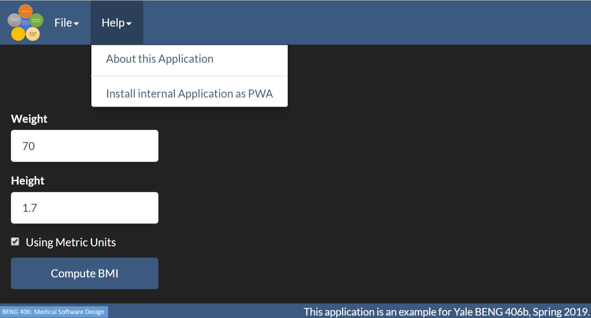

## Creating a Progressive Web Application.

In this example, we will introduce the Progressive Web Applications (PWAs).

A great introduction to this topic can be found on the
[Google Developers Webpage](https://developers.google.com/web/progressive-web-apps/).

We also recommend the [PWA Builder Tool](https://www.pwabuilder.com/) from Microsoft.

## PWAs

At the core to create an installable PWA, we need four things:

1. A service worker (see [web/serviceworker.js](web/serviceworker.js)).
2. A manifest file (see [web/manifest.json](web/manifest.json)) that is linked to from the main
   web page (`web/index.html`)
3. Code to register the service worker from the main application (see
   [code/pwautils.js](code/pwautils.js)) called from
   [code/main_applications.js](code/main_application.js).
4. Code to trap and expose the `install` event -- again see
   [code/pwautils.js](code/pwautils.js) called again from  [code/main_applications.js](code/main_application.js).

In addition the manifest file requires icons of our application at different
sizes. We used the tool that is part of PWA Builder to create these from a
single example. These icons can be found in [web/AppImages](web/AppImages).

## Install Dependencies

First install our runtime dependencies (biswebbrowser which includes jQuery,
boostrap, three.js and webcomponents), webpack and a local web server using:

	npm install -d
    
We also have a small shimming module `webcomponents-lite.js` in the externals
directory for those browsers that do not natively support custom web elements.
    
## To Run:

First build the JS bundle using:

    gulp webpack
    
The webpack configuration is in `config/webpack.config.js`. Note that we do
not bundle `jQuery` -- it is listed in `externals` in the webpack
configuration. Instead, we leave it as is and include this (and bootstrap)
directly in `index.html`.
    
Next run the application (either as a desktop application) using:

    electron web/electronmain.js

or as a web application, using:

    gulp webserver

or to actively develop use (see [Step 6](../step06).)

    gulp devel
    
### Installing as a PWA

This application is a progressive web application. This install as a desktop
application from the web page just fine under Chrome on Windows/Android. To
install on a Mac you will need to use Chrome. First enable the flag:
   
        chrome://flags#enable-desktop-pwas
        
Then open http://localhost:8080/web/index.html as usual.

See if you have an option under the Help menu to install this as a PWA (as
shown below)

